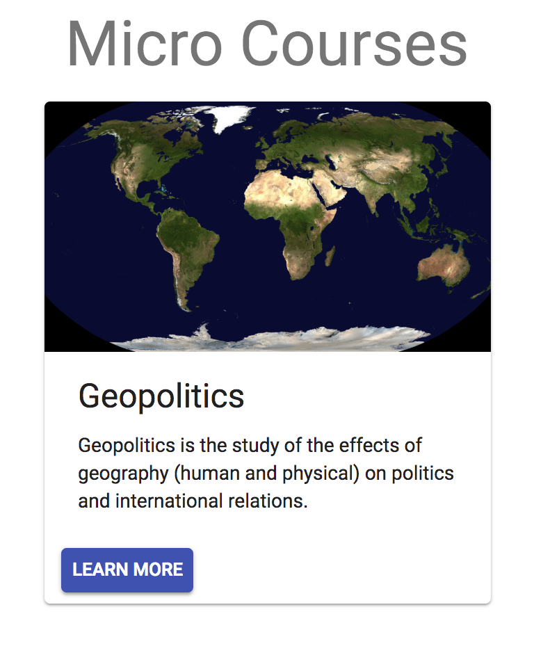
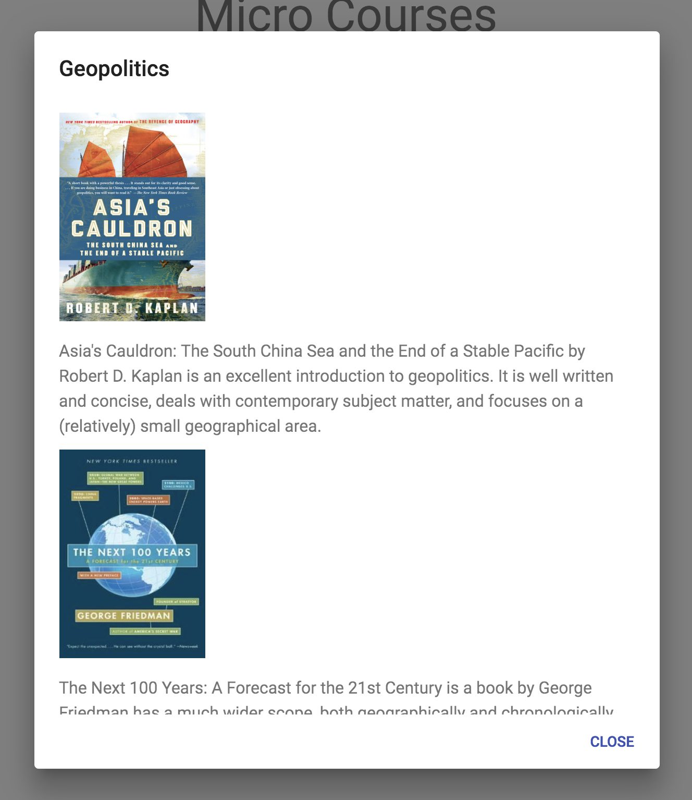

# Micro Courses

A website for short, introductory courses on a variety of topics, inspired by a reading list I made a friend to introduce them to geopolitics.

I built this as part of my ongoing project to learn more about React and its ecosystem. This project focusses on using open source components, in particular material-ui.

### Approach

As this project is part of a larger one to build many small websites exploring different facets of React, I wanted to really focus on exploring using open source components. The first step for this was trying out a few different libraries, and I eventually settled on material-ui due to its accessibility and thorough documentation. To get going with this as quickly as possible, the website was scaffolded with create-react-app, onto which I added small slices of functionality using material-ui's components.

### Dependencies

This project has some standard React dependencies in ```react```, ```react-dom```, and ```react-scripts```, as well as using ```@material-ui/core```.

### Getting Started

- Clone this repo
- Navigate to the directory
- run ```npm install```
- run ```npm start```

### Usage

The courses are organised on cards:



The course breakdown is found by clicking 'LEARN MORE', which displays a dialog box containing the course information:



### Testing

Since this project extensively uses trusted third-party components, there wasn't much to test without writing vacuous, unnecessary tests. There are however smoke tests for each component, which can be run with ```npm test```.

### Reflections
